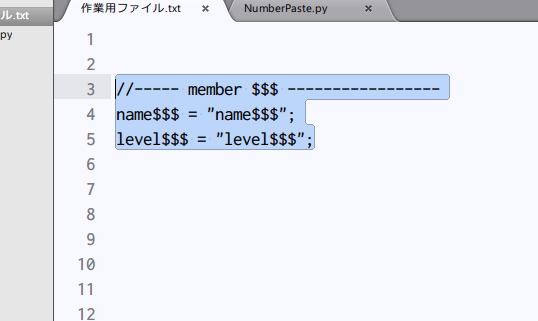
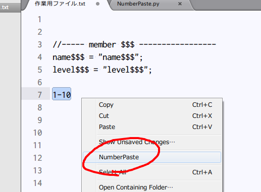
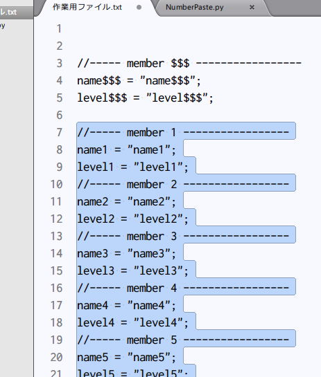

NumberPaste
===========
SublimeTextのプラグインです。数字部分が連番になっているダミーデータ制作のために作ったプラグインです。
英語は苦手なので説明は日本語ですが、プラグイン自体は言語を選ばず使用出来ると思います。

リポジトリ内にあるファイルのライセンスは、creative commonsのCC0です。

##インストール
  まずSublimeTextをインストールして下さい。
  SublimeText3とSublimeText2の両方に対応しています。
  その後git clonextを使うか、zipでダウンロードするかして、
  Data/Packages内にNumberPasteフォルダにファイルを入れて下さい。
　(最低限NumberPaste.pyとContext.sublime-menuだけあれば動きます)
　
##使い方

連番数字を入れたい部分を$$$とした文字列をCtrl+Cなどでコピーし、クリップボードに入れて下さい 。
（$$$は複数あっても構わないし、別のエディタ等からコピーしてもいいです）

1-10
100-161
010-200
といった数字２つをハイフンでつないだ文字列を書いた後で選択します。
右クリックしてNumberPasteをクリックして下さい。

選択していた文字列の代わりに、$$$を数字で置換した文字列が、 連番の数だけ改行を挟んでペーストされます。

開始番号が0で始まる場合は、ゼロ埋め(zero padding)で書き込まれます。

##今後のバージョンアップ予定

今のところはないですが、何か必要な機能が出てきたら追加すると思います。
Pullリクエストがあれば歓迎です。